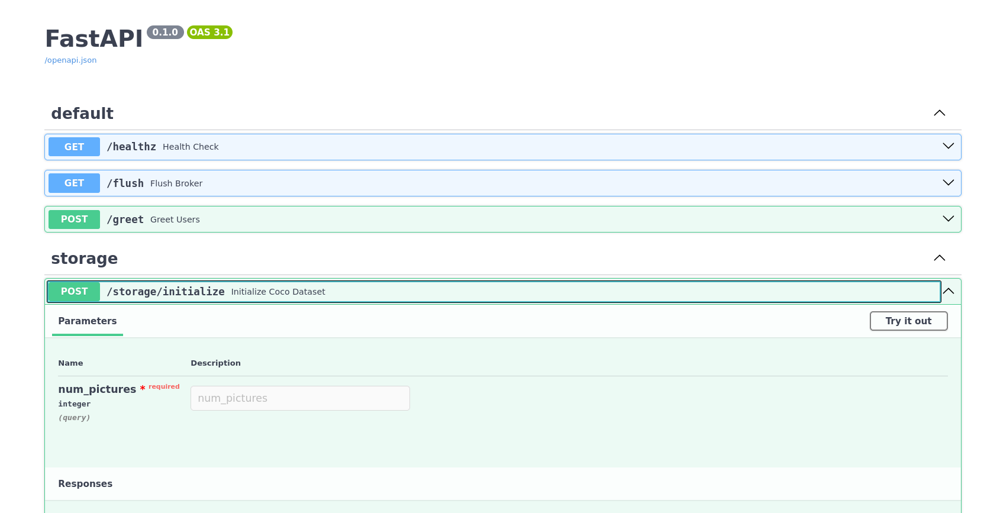
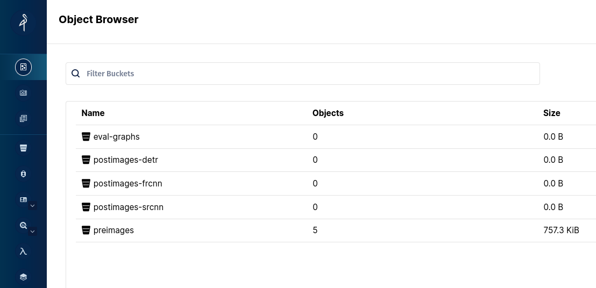

# CNN-Infer

## Table of Content

- [Overview](#overview)
- [Pre-requisites](#pre-requisites)
- [Start the Application](#starting-the-application)
- [Reference](#reference)


## Overview

CNN-Infer is an experimental deployment exploring the use of modern infrastructure technology stack to develop, and deploy machine learning application in an expeditious manner. The objective is to infer a subset of the COCO images using a select number of CNN architecture models.

## Pre-requisites

1. Install `Docker`
    - Windows: https://docs.docker.com/desktop/install/windows-install/
    - Mac: https://docs.docker.com/desktop/install/mac-install/
    - Linux: https://docs.docker.com/engine/install/ubuntu/

2. Install `Kubernetes` (Minikube)
    - Windows/MacOS/Linux: https://minikube.sigs.k8s.io/docs/start/

3. Install `Helm`
    - Windows/MacOS/Linux: https://helm.sh/docs/intro/install/

4. Install `kubectl`
    - Windows: https://kubernetes.io/docs/tasks/tools/install-kubectl-windows/
    - MacOS: https://kubernetes.io/docs/tasks/tools/install-kubectl-macos/
    - Linux: https://kubernetes.io/docs/tasks/tools/install-kubectl-linux/


## Starting the Application:

> **Note**: I will be assuming the user OS is `MacOS` or `Linux`. As a result, the directions will be specific to the respective OS

1. Install the pre-requisites
2. Clone this application repo: https://github.com/Fallensegal/cnninfer
3. Install `Helm` dependencies:
    - Make sure you are in the project root directory
    - Add the following `Helm` chart repo as part of the `Helm` tool

    ```bash
    helm repo add bitnami https://charts.bitnami.com/bitnami
    helm repo update
    ```
    - Build `Helm` dependencies

    ```bash
    helm dependency build ./deploy
    ```

4. Start `Minikube`

    ```bash
    minikube start
    ```
    *Expected Output (Similar Output):*
    ```bash
    😄  minikube v1.32.0 on Debian bookworm/sid
    ✨  Using the docker driver based on existing profile
    👍  Starting control plane node minikube in cluster minikube
    🚜  Pulling base image ...
    🔄  Restarting existing docker container for "minikube" ...
    🐳  Preparing Kubernetes v1.28.3 on Docker 24.0.7 ...
    🔗  Configuring bridge CNI (Container Networking Interface) ...
    🔎  Verifying Kubernetes components...
        ▪ Using image gcr.io/k8s-minikube/storage-provisioner:v5
    🌟  Enabled addons: storage-provisioner, default-storageclass
    🏄  Done! kubectl is now configured to use "minikube" cluster and "default" namespace by default

    ```

5. Start the application

    ```bash
    tilt up
    ```
    *Expected Output*
    ```bash
    Tilt started on http://localhost:10350/
    v0.33.6, built 2023-09-29

    (space) to open the browser
    (s) to stream logs (--stream=true)
    (t) to open legacy terminal mode (--legacy=true)
    (ctrl-c) to exit

    ```
    - You can visit `localhost:10350` on a web-browser to check on the deployment building. When all deployment resources are ready, navigate to `localhost:8000` to access the application.

## Running an Infer Query

The application currently has one api endpoint that will run an inference workload. It takes in a user input of how many pictures the user would like to infer and uploads the bounded box results to the application S3 bucket located on the stack.

1. Make sure the application is ready. You can tell when `tilt` shows 7/7 resources ready
2. To access the API endpoint, navigate to `localhost:8000/docs`, this will pull up the Swagger API documentation endpoint. This gives you an interface to try out the api endpoints.

3. Initialize the S3 Buckets and ASGI application with the COCO dataset.
    - Click the dropdown on `/storage/initialize`
    - Click `Try it out`
    - Provide an integer (5-10 should be adequate)
    - Click execute



4. You should see a 200 response code, meaning that the service has successfully acquired 5 images from the 2017 COCO Validation set and placed it on your S3 bucket.

5. To see the contents of your S3 bucket you will need to get your admin user and password. The `Username` is set to `admin`. Your password is encoded in `Base64` as a kubernetes secret that gets refreshed each time you deploy:

    - You can acquire it by executing the following commands:

     ```bash
      $> kubectl get secret chart-minio -o yaml  
      ```

    - Example Output:
    ```yaml
    apiVersion: v1
        data:
            root-password: SDJtUkFqUXFOcg==
            root-user: YWRtaW4=
        kind: Secret
        metadata:
        annotations:
            kubectl.kubernetes.io/last-applied-configuration: |
            {"apiVersion":"v1","data":{"root-password":"SDJtUkFqUXFOcg==","root-user":"YWRtaW4="},"kind":"Secret","metadata":{"annotations":{},"labels":{"app.kubernetes.io/instance":"chart","app.kubernetes.io/managed-by":"tilt","app.kubernetes.io/name":"minio","app.kubernetes.io/version":"2023.11.11","helm.sh/chart":"minio-12.10.0"},"name":"chart-minio","namespace":"default"},"type":"Opaque"}
        creationTimestamp: "2023-11-20T03:18:13Z"
        labels:
            app.kubernetes.io/instance: chart
            app.kubernetes.io/managed-by: tilt
            app.kubernetes.io/name: minio
            app.kubernetes.io/version: 2023.11.11
            helm.sh/chart: minio-12.10.0
        name: chart-minio
        namespace: default
        resourceVersion: "182104"
        uid: 054b37ac-f103-4eff-8e49-3ff56b57e47b
        type: Opaque
    ```

    - Decode the `root-password` using a `Base64` decoder. that is your admin password.

<br></br>
6. Navigate to `localhost:9001` and use your credentials. It should look like this.




7. Go back to the Swagger UI and execute the `/coco/coco/infer` api route. You will most likely have to wait while the system distributes the task and the inference is executed, whice includes downloading the `Sparse R-CNN` model and passing the images through.

- You will most likely experience a 500 error as `Dramatiq` cannot serialize `Pydantic` models to JSON. However, the inference should still complete and you can see that on the S3 bucket under `postimages-srcnn`

    
## Reference

- No code was copied from other repositories other than using readily available frameworks

### Application Dependencies

1. **Infrastructure**
    - Dependency Management: [Poetry](https://python-poetry.org/), [Polylith](https://davidvujic.github.io/python-polylith-docs/)
    - Environment Standardization: [Containerization (Docker)](https://www.docker.com/)
    - Deployment Orchestration: [Kubernetes (Minikube)](https://kubernetes.io/)
    - Deployment Build Manager: [Tilt](https://tilt.dev/)

2. **Application**
    - Type Safety: [Pydantic](https://docs.pydantic.dev/latest/)
    - Web Application (Backend): [FastAPI](https://fastapi.tiangolo.com/)
    - Database/Task Queue: [Redis](https://redis.io/)
    - Task Runners: [Dramatiq](https://dramatiq.io/)
    - Inference Engine: [PyTorch](https://pytorch.org/), [MMDetection](https://github.com/open-mmlab/mmdetection)

3. **Dataset**
    - 2017 COCO Validation Dataset and Annotations ([Object Detection](https://cocodataset.org/#home)):
    - The dataset was obtained using the [PyCOCOTools](https://github.com/cocodataset/cocoapi/tree/master/PythonAPI) library, which is a curl wrapper for the COCO api

